<!-- The YAML block sits above this -->

\vspace{2.5em}

\noindent\fbox{%
  \parbox{\dimexpr\linewidth-2\fboxsep-2\fboxrule}{%
    \textbf{Author:} Koushani Roy \\
    \textbf{Roll No:} 134 \\
    \textbf{Semester:} 1 \\
    \textbf{Paper Code:} C1PH230112P \\
    \textbf{Subject:} Clab - 1, UG (Physics) \\
    \textbf{Institution:} St. Xavier's College (Autonomous), Kolkata \\
    \textbf{Date:} August 10, 2026
  }%
}

\pagebreak

## 1. Introduction

- Purpose of using Command Line Interface:

The Command Line interface (CLI) provides a faster way to relay instructions to the computer as opposed to clicking through a Graphical User Interface (GUI). This makes it much easier and less time intensive to perform repititive tasks and automate some other kinds of operations. 

### 1.1 Commands shown in Class

```Bash
# Win + R -> cmd
dir 
#Listings special: cd . -> Current folder, cd . . -> Parent folder
#3rd fn of cd -> Shows name of current folder
mkdir foldername 
#creates a new directory
rmdir foldername 
#deletes a directory (has to be empty unless you force it)
move file_name1 destination 
#moves a file to another location, same syntax logic as copy
ren old_name new_name 
#renames a file
del file_name 
#deletes a file
cd | clip 
#piping, copying the folder name to clipboard
start . 
#opens folder in which you are in
/? 
#help
#no touch in Windows, directly echo smth to get the file out of nowhere
> 
#overwrite
>> 
#append
type file_name 
#views file in cmd
copy file_name1 file_name2 
#even when second file DNE
copy ..\a\*.txt ..\c
#everything in one line when you are in folder b
/p 
#pauses output aka asks y/n every step e.g., deletion
/s 
#forces, force del like when you have smth in the dir you want to remove
wd -d . 
#go to the designated folder in GUI and type this on the window to directly access Powershell
cmd 
#same way, cmd also words and cmd is ultimate destination even from Powershell
copy /filepath .
#copies to this folder without creation of new name
magick clipboard: cli.png
#first use imagemagick dwld and then use snipping tool
cls
#clears the clutter on screen
```

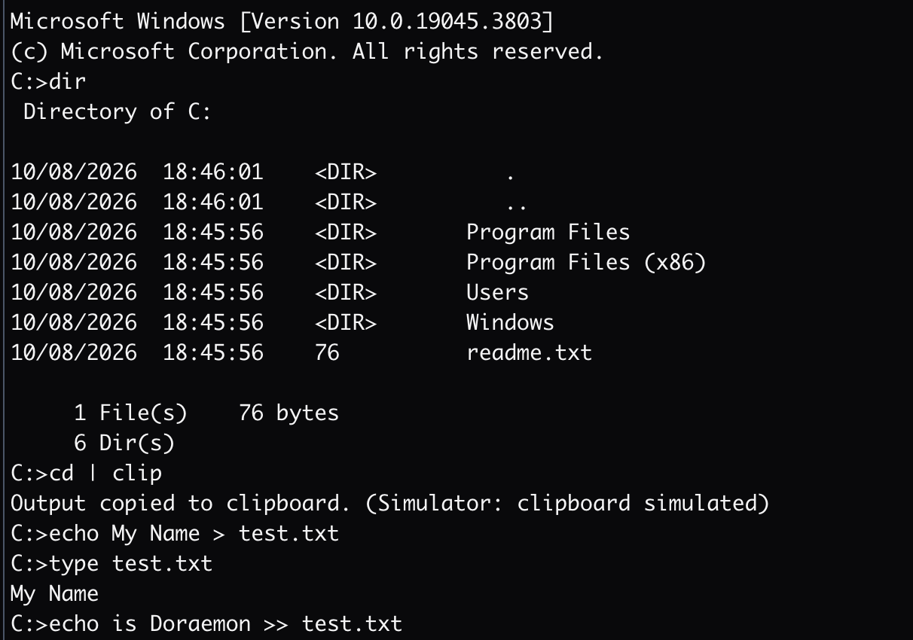

*Note: Since I lack a Windows device, a online simulator has been used.*

### 1.2 Commands in Factsheet

```Bash
del /p 
#same /p as before but specifically for del -- confirms Y/N before deleting ech file, not force delete 
exit 
#closes the terminal session
dir /w 
#lists contents in wide format, squeezes more names per line so less detail
dir /b 
#bare format (names only), no dates/sizes/etc
echo %cd% 
#prints current folder path as text 
more filename 
#views file page by page, pauses at each screen 
python 
#launches Python interpreter if installed
wgnuplot 
#launches Gnuplot for plotting if installed
where python 
#finds the filepath of the installed python.exe
```

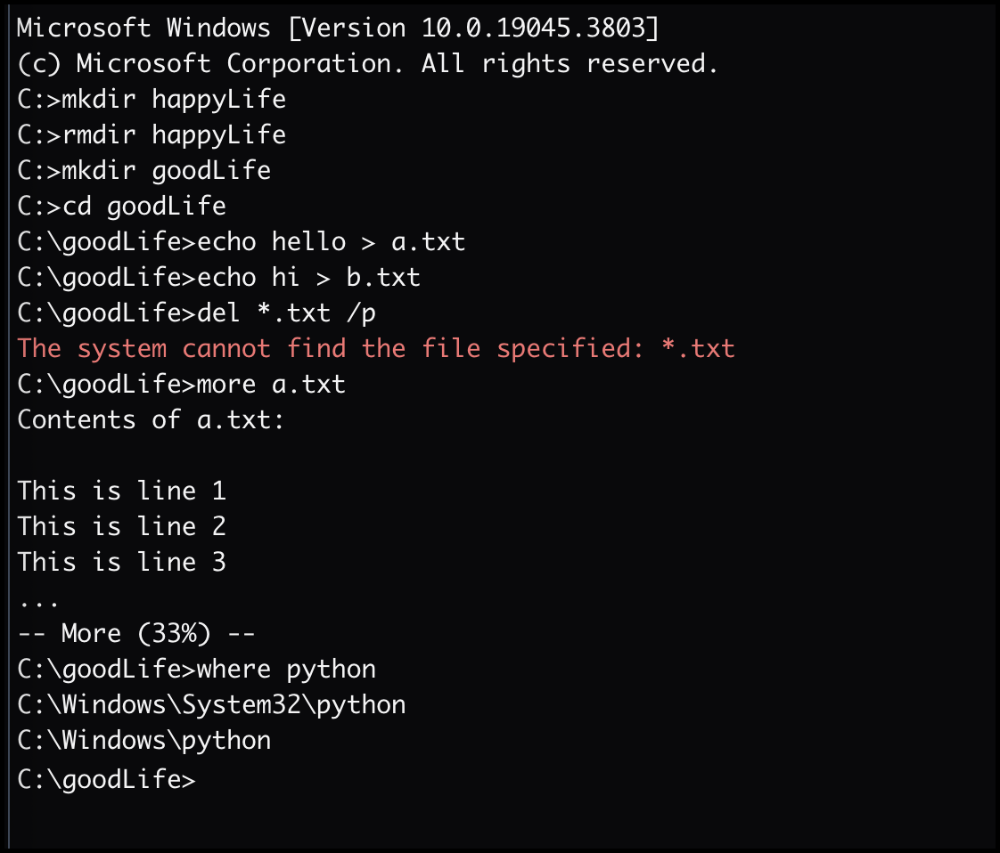

*Note: It is worth mentioning I couldn't run all the outputs on a simulator. However the tasks in section two were performed on a real Windows machine last week hence are realistic.*

## 2. Commands and Outputs

### 2.1 [Task 1: Directory creation and verification]{.underline}

```bash
cd PHY134SEM12026 
mkdir CLI_DOS_July2026 
cd CLI_DOS_July2026 dir /p

```

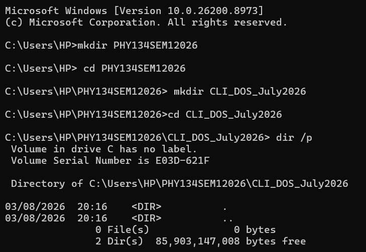

### 2.2 [Task 2:  File creation]{.underline}

```Bash
echo CLI DOS Experiment Notes > notes.txt 
type notes.txt 
more notes.txt 
```

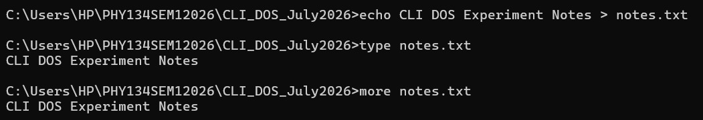

### 2.3 [Task 3:  File Relocation]{.underline}

```Bash
mkdir Data move notes.txt Data 
cd Data dir 
cd .. 
```

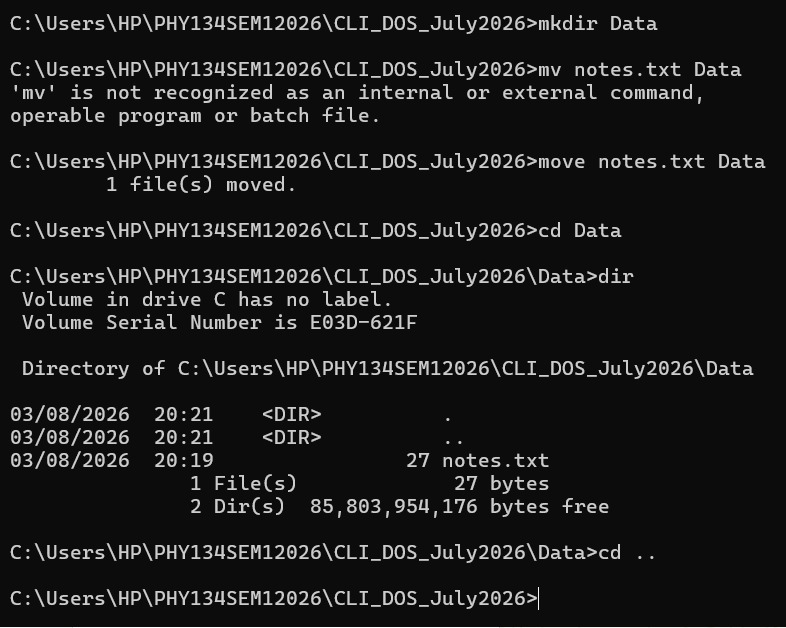

### 2.4 [Task 4: System Diagnostics Script]{.underline}

```Bash
type system_report.txt
```

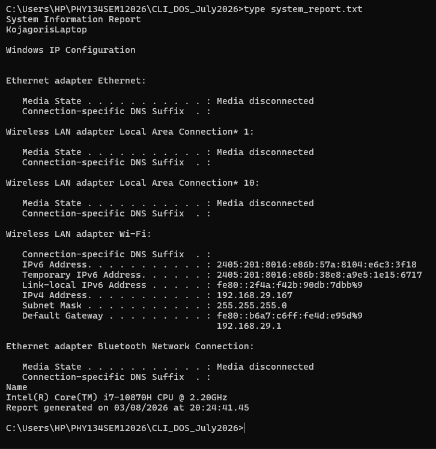

### 2.5 [Task 5: Txt File Creation and update]{.underline}

```Bash
echo Test File > test.txt
echo Updated on %DATE% >> test.txt
cls
```

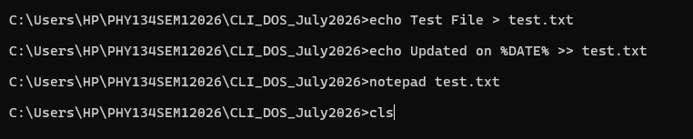

### 2.6 [Task 6: sin(x) Plotting]{.underline}

```Bash
cd gnuplot 
"C:\Program Files\gnuplot\bin\gnuplot.exe" 
plot sin(x)
```
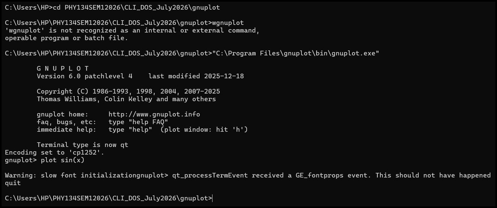

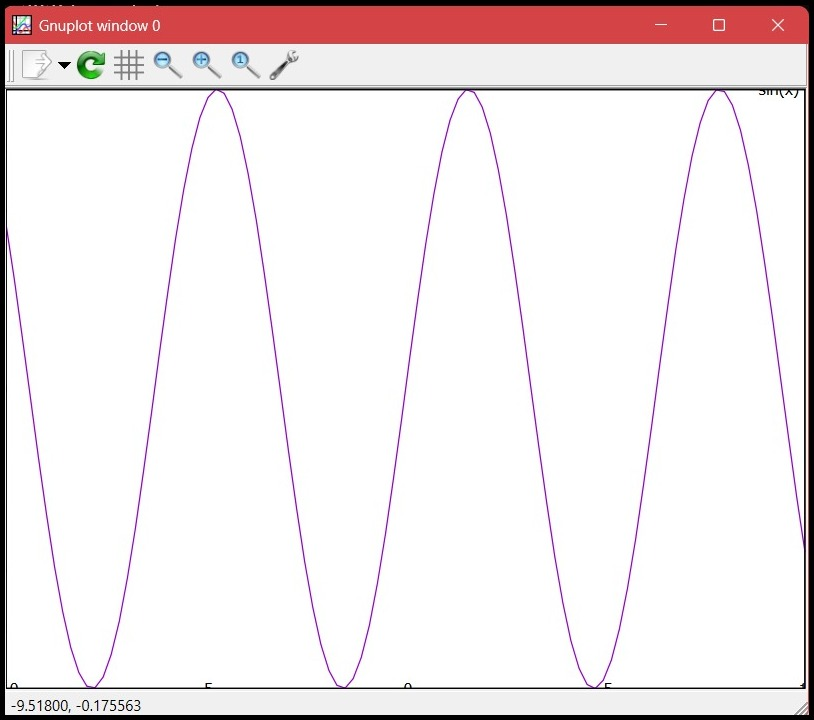

### 2.7 [Task 7: Directory listing ]{.underline}

```Bash
dir /b > bare\_list.txt 
more bare\_list.txt

```

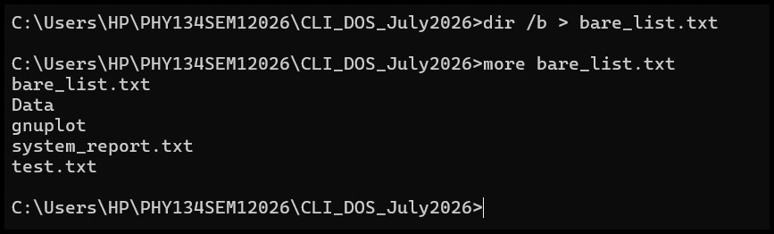

## 3. Experience (Workspace setup, MacOS)

Since I am on a machine running MacOS, the process of installation differs vastly from the one in Windows.

Firstly, the command-line package manager for MacOS isn't one distributed by Apple natively so you can use any of the free ones found online. I use `brew` and `brew install <package>` manages fetch/install/updates without manual intervention.

The packages notably mentioned in Lab to be installed included:

- pandoc
- Imagemagick
- GnuPlot
- Python

### 3.1 About Python

It is worth noting that instead of using the native `pip` globally, I prefer creating a virtual environment per project and locally install any module I need. This is a precaution against certain dependency conflicts (like different projects needing different versions)  that I have faced in the past and a certain `error: externally-managed-environment` too.

### 3.2 About MarkText 

This was the one suggested in the lab however the version for MacOS is depreciated and hence I switched to using `VSCode` with proper extensions. Also, worth mentioning, I used the `xelatex` renderer with pandoc since I had used that before and already had a compatible yaml template.

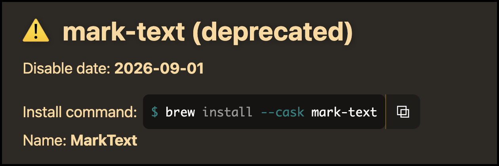

## 4. Conclusion

The advantage of CLI (vs GUI) compounds as the number of files and folders grows when in comparison, the GUI equivalent gets slower, boring and more error-prone as scale increases.

Beyond speed, the CLI (unlike GUI) allows repeating the exact same commands very easily. In MacOS, for example, you could press `Ctrl+R` and repeat any command from history, eliminating the need for retyping. This distinction matters greatly since one does not get the matter at hand succesfully at first go most of the times.
