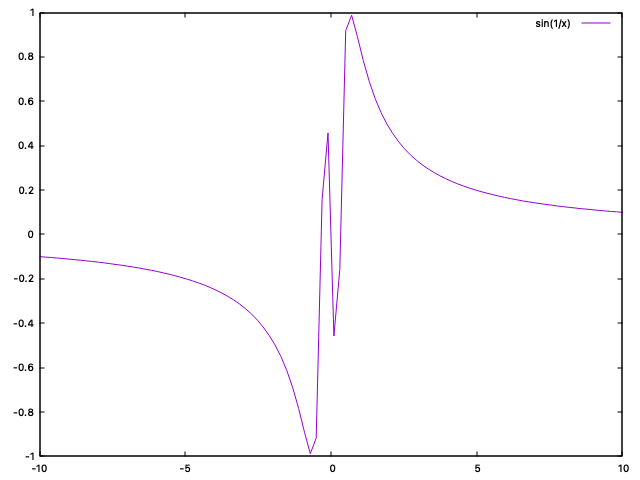
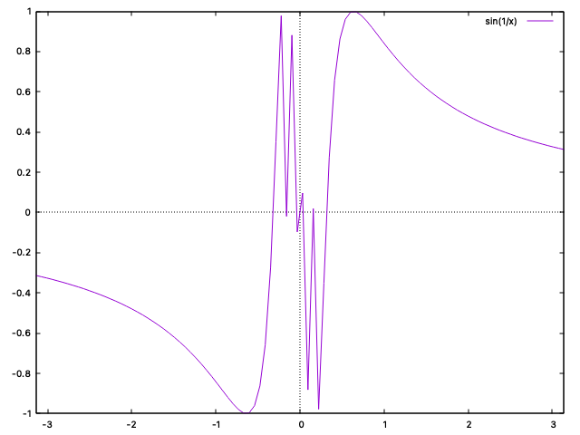
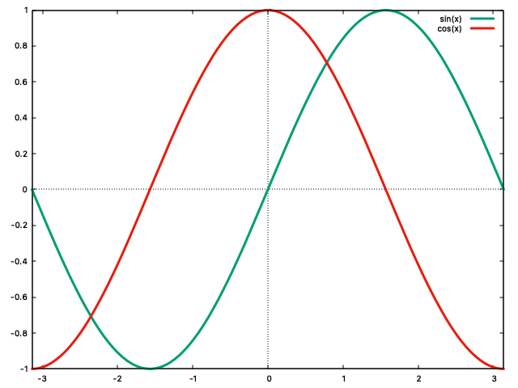
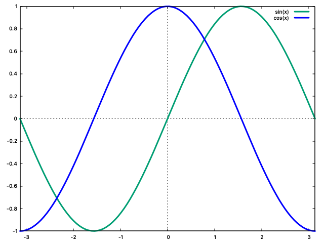

\vspace{2.5em}

\noindent\fbox{%
  \parbox{\dimexpr\linewidth-2\fboxsep-2\fboxrule}{%
    \textbf{Author:} Koushani Roy \\
    \textbf{Roll No:} 134 \\
    \textbf{Semester:} 1 \\
    \textbf{Paper Code:} C1PH230112P \\
    \textbf{Subject:} Clab - 1, UG (Physics) \\
    \textbf{Institution:} St. Xavier's College (Autonomous), Kolkata \\
    \textbf{Date:} August 11, 2026
  }%
}

\pagebreak

## 1. Lab 1 - Plotting Functions

### 1.1 Intialisation


#### Windows

Type `wgnuplot` in desired directory in the terminal window.

#### Mac OS/Linux

Does not have any dedicated GUI like `wgnuplot.exe` for Windows. Type `gnuplot` in termnal to begin.

---

Initialising in a Windows machine:

```bash

 G N U P L O T
        Version 6.0 patchlevel 4    last modified 2025-12-18 

        Copyright (C) 1986-1993, 1998, 2004, 2007-2025
        Thomas Williams, Colin Kelley and many others

        gnuplot home:     http://www.gnuplot.info
        faq, bugs, etc:   type "help FAQ"
        immediate help:   type "help"  (plot window: hit 'h')

        Terminal type is now windows
 gnuplot> 
```

Note: If mathematical symbols not rendered correctly, you must run `set term win enhanced` to be sure.

### 1.2 Plotting basic curves

```bash
        gnuplot> plot sin(1/x)
```


### 1.3 Setting range and axis

```bash
        gnuplot> set zeroaxis
        gnuplot> plot [-pi:pi] sin(1/x**2)
```


### 1.4 Adding colours and changing line widths

```bash
        gnuplot> plot [-pi:pi] [:] sin(x) ls 2 lw 3  
        gnuplot> plot [-pi:pi] [:] sin(x) ls 2 lw 3, cos(x) ls 7 lw 3
        gnuplot> plot [-pi:pi] [:] sin(x) ls 2 lw 3, cos(x) ls 7 lw 3 lc 'blue'
```

The part `[:]`  lets the y-axis autoscale. You can stack subsequent functions in one graph by separating the instructions with a `,`. 



`ls` stands for linestyle (one of the presets gnuplot comes with, different presets have different colour or dash pattern combos). However you can explicitely force features on the linestyles too for example, `lc 'blue` forces linecolour blue on whatever colour linestyle 7 would have defaulted to. 

`lw` stands for landwidth and determines how bold the lines are. 



### 1.5 Other features

- There are different terminal types in gnuplot: some open an interactive window, some write straight to a file.

- Zoom in on functions by clicking and dragging a rectangle on the plot.

- Moving the cursor at different points on curve reveals the coordinates.

- Press 'r' to introduce a ruler element which is intersection of two lines and tells you the distance of different other points you hover from that given point.

- In mathematical operations use `**` for exponents. 

```bash
        gnuplot> h(x) = x**2 - 2**x + 1 
        gnuplot> plot h(x)
```

---
